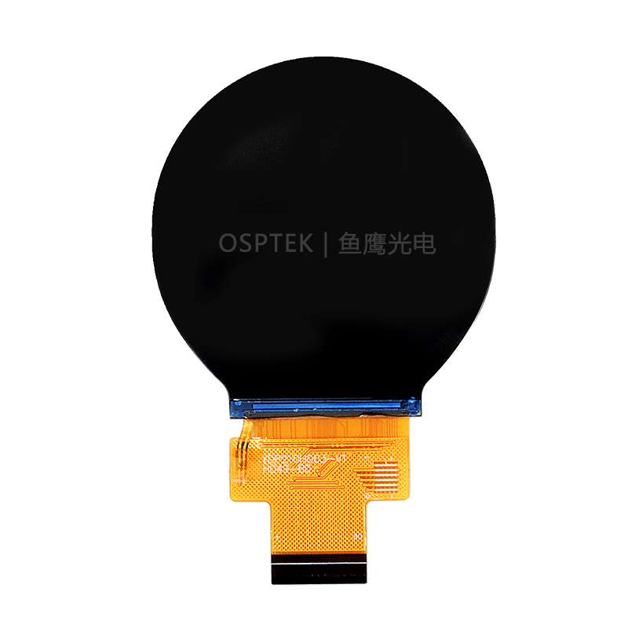

<p align="left"></p>

<h1 align="center">OSPTEK 2.1″ TFT 480×480 (ST7701 · MIPI)</h1>

<p align="center"><b>Square TFT / IPS module · MIPI · ST7701 · capacitive touch</b></p>

<p align="center"><a href="./README.md">简体中文</a> | English · <a href="../../README_EN.md">Family index</a></p>

<p align="center">
  
  
  
  
</p>

<p align="center"></p>

## Contents

- [Overview](#overview)
- [Specifications](#specifications)
- [Sample projects](#sample-projects)
- [Repository layout](#repository-layout)
- [Resources](#resources)
- [Buy](#buy)
- [Support](#support)

---

## Overview

OSPTEK **2.1″ 480×480 TFT (IPS)** is a **MIPI** color display module driven by **ST7701 (ST7701S)**, with **capacitive touch (I2C)**. Suited to small HMI, instruments, and square interactive panels.

Spec ID (repository name): `tft-2.1-480x480-mipi-st7701`

Current module version: **YDP210H003-V1**. Electrical and mechanical details follow [`docs/YDP210H003-V1.pdf`](./docs/YDP210H003-V1.pdf).

## Specifications

| Item | Spec |
| ---- | ---- |
| Size | 2.1 inch |
| Type | TFT / IPS (color) |
| Resolution | 480×480 |
| Interface | MIPI |
| Driver IC | ST7701 |
| Touch | Capacitive (I2C; IC not named in the datasheet) |

> Full outline, FPC pinout, power, and timing follow the product datasheet / driver manual.

## Sample projects

| Description | Path |
| ----------- | ---- |
| ESP32-P4 · ST7701 MIPI + LVGL9 | [`examples/esp32p4-idf5_st7701-mipi_lvgl9/`](./examples/esp32p4-idf5_st7701-mipi_lvgl9/) |
| Raspberry Pi 5 · ST7701 480×480 panel / DT overlay | [`examples/rpi5-panel-st7701-480x480/`](./examples/rpi5-panel-st7701-480x480/) |

## Repository layout

```text
tft-2.1-480x480-mipi-st7701/          # repo root (nav: ../../README_EN.md)
└── versions/
    └── YDP210H003-V1/                # full materials for this part number
        ├── README.md
        ├── README_EN.md
        ├── images/
        ├── docs/
        └── examples/
```

## Resources

### Product files

| File | Link |
| ---- | ---- |
| Product datasheet (YDP210H003-V1) | [`docs/YDP210H003-V1.pdf`](./docs/YDP210H003-V1.pdf) |
| Driver IC datasheet (ST7701S) | [`docs/ST7701S_SPEC_V1.3.pdf`](./docs/ST7701S_SPEC_V1.3.pdf) |

### Sample projects

- [ESP32-P4 ST7701 MIPI + LVGL9](./examples/esp32p4-idf5_st7701-mipi_lvgl9/)
- [Raspberry Pi 5 ST7701 panel](./examples/rpi5-panel-st7701-480x480/)

## Buy

<p align="center">
  <a href="https://www.aliexpress.com/store/1105701619"></a>
  &nbsp;&nbsp;
  <a href="https://shop110742373.taobao.com/"></a>
</p>

**International (AliExpress)**

- Store: [OSPTEK Official Store](https://www.aliexpress.com/store/1105701619)

**China (Taobao)**

- Store: [鱼鹰光电工厂店](https://shop110742373.taobao.com/)

## Support

- Technical Support / Sales: <luyu@osptek.com>
- QQ Technical Group: **985881096**
- Website: <https://osptek.com/>
- Feel free to open an Issue in this repository if you have any questions

---

<p align="center"><sub>© 2026 OSPTEK · Licensed under CC BY 4.0</sub></p>
